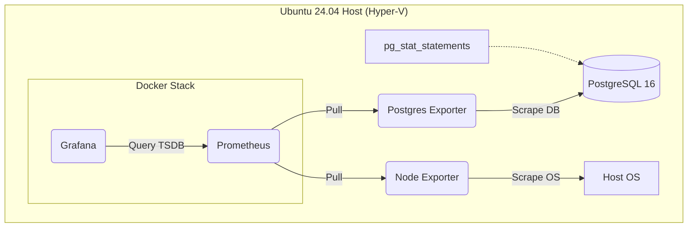
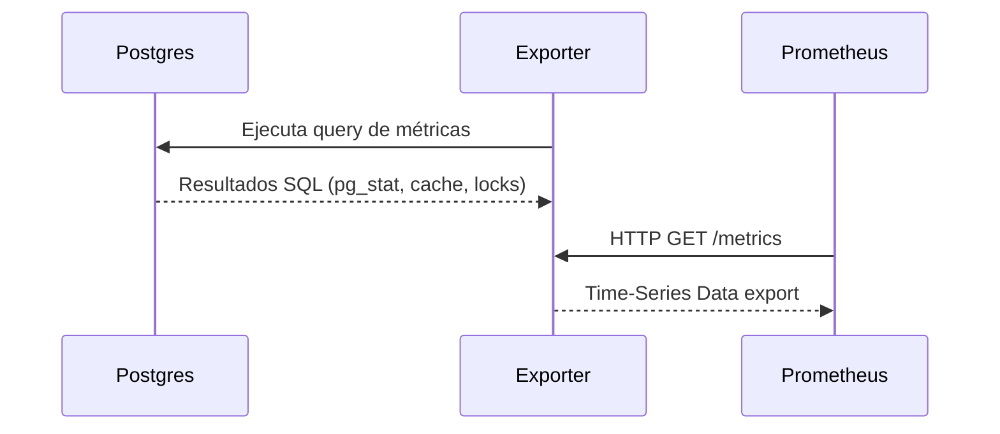

# 01. Arquitectura del Proyecto

Este documento describe la arquitectura técnica, flujo de datos y relación entre los componentes de observabilidad.

## Diagrama Funcional de Arquitectura

## Flujo de Datos

Volver al README: 👉 [../README.md](../README.md)
Siguiente: 👉 [02-installation.md](02-installation.md)
